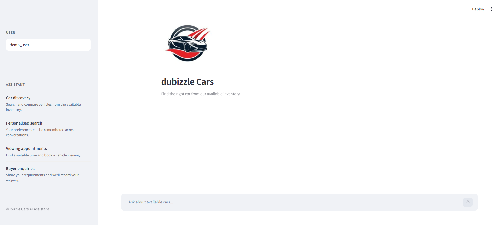
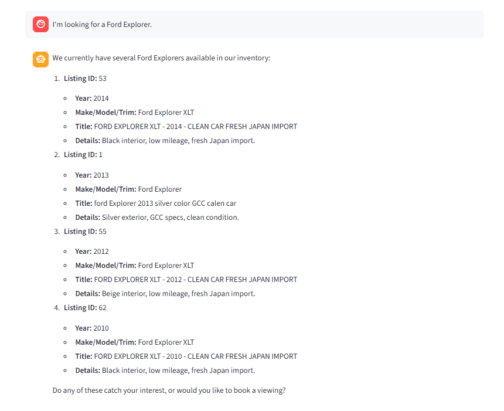
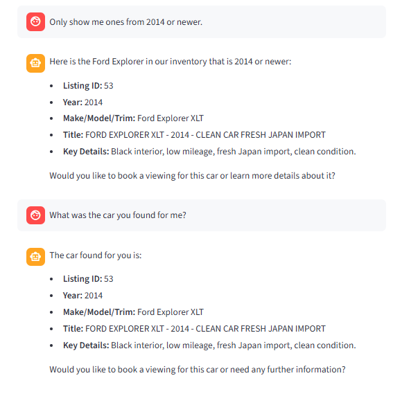
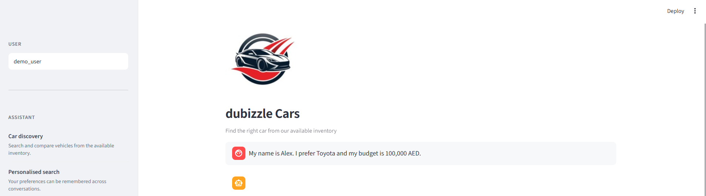
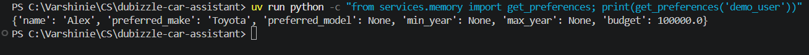
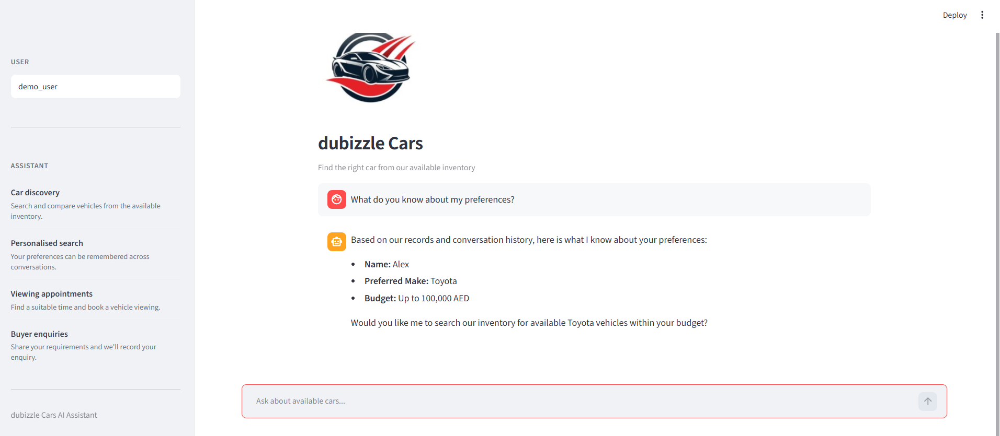

# dubizzle Cars AI Assistant

An AI-powered car shopping assistant built as a technical case study for dubizzle Cars.

The assistant supports vehicle search, multi-turn conversations, preference memory, lead qualification, and simulated viewing bookings.

> This is an independent prototype developed as part of a technical case study. It is not an official dubizzle product.

## Features

- Natural-language car search
- Hybrid structured + semantic retrieval
- Multi-turn conversation memory
- Long-term user preference memory
- Lead qualification and CSV storage
- Vehicle viewing booking
- Automotive-only guardrails

## Project Structure

```text
dubizzle-car-assistant/
├── data/
│   ├── cars.xlsx
│   └── ...
├── services/
│   ├── inventory.py
│   ├── semantic_search.py
│   ├── memory.py
│   ├── booking.py
│   └── leads.py
├── assets/
│   └── image.png
├── app.py
├── main.py
├── pyproject.toml
├── uv.lock
├── .env.example
└── README.md
````

## Setup

### 1. Install dependencies

```bash
uv sync
```

### 2. Add the Gemini API key

Create `.env` in the project root:

```text
GEMINI_API_KEY=your_gemini_api_key_here
```

### 3. Start the backend

```bash
uv run uvicorn main:app --reload
```

Backend:

```text
http://127.0.0.1:8000
```

### 4. Start the Streamlit client

In a second terminal:

```bash
uv run streamlit run app.py
```

Interface:

```text
http://localhost:8501
```

## Technology Choices

**Client — Streamlit:** Chosen over a notebook because the project is a conversational assistant and benefits from a simple interactive chat interface. It keeps the prototype lightweight while providing a clear demonstration of the user experience.

**Agent — Google Gemini:** Gemini handles natural-language understanding and decides when to use application tools. Inventory search, memory, lead saving, and booking are implemented as Python functions, keeping application operations deterministic.

**Retrieval — Hybrid Search:** Structured filters handle requirements such as make, model, and year, while Sentence Transformers and cosine similarity handle natural-language queries. This combines precise filtering with semantic matching.

**Memory — SQLite:** SQLite provides simple local persistence without requiring an external database. Conversation history supports short-term context, while stored user preferences provide long-term memory across sessions.

## Design Decisions

The system separates the conversational layer from application logic. Gemini handles conversation and tool selection, while FastAPI and the Python services handle inventory retrieval, memory, lead storage, and booking validation. Vehicle information is grounded in the provided inventory rather than generated by the model.

The prototype focuses on the core car-shopping workflow and intentionally avoids production infrastructure. Local SQLite/CSV storage, simulated viewing availability, and the provided inventory keep the system simple and reproducible.

## Out of Scope

The following are intentionally outside the scope of this prototype:

* Real payment processing
* Real dealership/calendar integration
* Production authentication and user accounts
* Real-time vehicle inventory synchronization
* Production database deployment
* Actual booking confirmations
* Competitor marketplace integration

## Demo Evidence

### Prototype overview screenshot


### 1. Multi-turn Inventory Search

The assistant maintains conversation context while refining an inventory search.

```text
User: I'm looking for a Ford Explorer.
Assistant: [Returns matching Ford Explorer listings]

User: Only show me ones from 2014 or newer.
Assistant: [Narrows the results]

User: What was the car you found for me?
Assistant: [Recalls the relevant vehicle]
```

**Screenshot:** Successful multi-turn inventory conversation.



### 2. Long-term Memory

User preferences are stored in SQLite and can be recalled in a completely new session using the same user ID.

```text
Session 1
User: My name is Alex. I prefer Toyota and my budget is 100,000 AED.
Assistant: [Stores the preferences]

Session 2
User: What do you know about my preferences?
Assistant: [Recalls Alex's Toyota preference and 100,000 AED budget]
```

**Screenshot:** Preference recall in a new session.




## Additional Functionality

* Qualified leads are saved to `data/leads.csv`
* Viewing slots are available Monday-Saturday, 8:00 AM-8:00 PM
* Booking uses 30-minute slots
* Inventory results are validated against the provided dataset
* The assistant declines unrelated requests
* The assistant does not recommend competitor marketplaces

## Technologies

Python · FastAPI · Streamlit · Google Gemini · Sentence Transformers · scikit-learn · Pandas · SQLite · uv